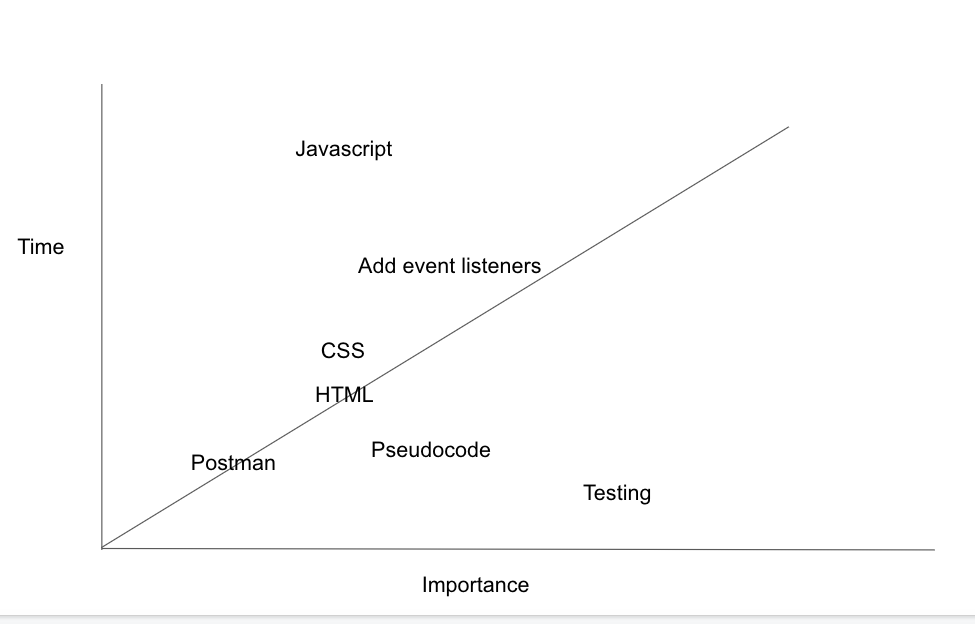

# Project Overview

## Project Name
pawsForLife

## Project Description

This project will allow people to search for pets that need rescuing by specifics valuable to them (i.e location, breed, coat length etc.)
## API and Data Sample

[https://www.petfinder.com/developers/]
## Wireframes


#### MVP 
- Allows user to search for animals that need rehoming
- User can search by their needs (i.e. coat length, breed, location)
- Help foster and adoptive parents have access to see by specific organizations


## Project Schedule


|  Day | Deliverable | Status
|---|---| ---|
|Dec 18| Prompt / Wireframes / Priority Matrix / Timeframes | Complete 
|Dec 21| Project Approval | Complete
|Dec 22| Core Application Structure (HTML, CSS, etc.) | Incomplete
|Dec 23| Pseudocode / actual code | Incomplete
|Jan 4| MVP | Incomplete
|Jan 5| Presentations | Incomplete

## Priority Matrix


## Timeframes


| Component | Priority | Estimated Time | Time Invested | Actual Time |
| --- | :---: |  :---: | :---: | :---: |
| Adding Form | H | 3hrs| 3.5hrs | 3.5hrs |
| Pseudocoding | H | 3hrs| 2.5hrs | 2.5hrs |
| CSS | H | 3hrs| 2.5hrs | 2.5hrs |
| HTML | H | 3hrs| 2.5hrs | 2.5hrs |
| JAVASCRIPT| H | 3hrs| 2.5hrs | 2.5hrs |
| Working with API | H | 3hrs| 2.5hrs | 2.5hrs |
| Working with API | H | 3hrs| 2.5hrs | 2.5hrs |
| Total | H | 6hrs|  |  |

## Code Snippet

Use this section to include a brief code snippet of functionality that you are proud of and a brief description.  

```
  {
    "id": 50103772,
    "organization_id": "IL542",
    "url": "https://www.petfinder.com/dog/collins-50103772/il/bloomington/wish-bone-canine-rescue-il542/?referrer_id=2bfae57e-89c9-45d2-b451-e8913c868a77",
    "type": "Dog",
    "species": "Dog",
    "breeds": {
        "primary": "Cockapoo",
        "secondary": null,
        "mixed": true,
        "unknown": false
    },
```

## Change Log
 Use this section to document what changes were made and the reasoning behind those changes.  
